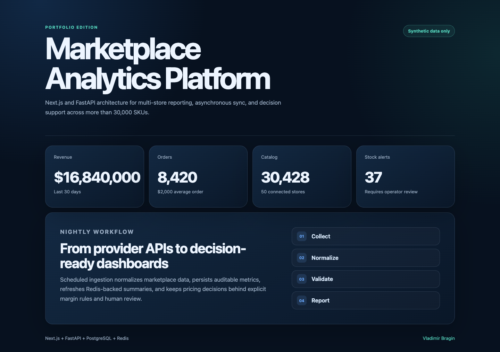

# Marketplace Analytics Platform

[](https://github.com/Arbitr3103/marketplace-analytics-platform/actions/workflows/ci.yml)

A sanitized portfolio edition of a production-used marketplace analytics and automation workflow.

Owner-verified operational results: the private system supports 50 stores and more than 30,000 SKUs. Nightly data collection, reporting, dashboards, and pricing checks reduced daily analysis from several hours to approximately 20-30 minutes. This public edition keeps the architecture and engineering patterns while using synthetic data and excluding provider credentials, customer identifiers, production infrastructure, and private business rules.

## Demo dashboard



Captured from the locally running Next.js and FastAPI demo. Every displayed value comes from deterministic synthetic fixtures; no customer or provider data is included.

## My role

I designed and implemented the public full-stack architecture, including the
FastAPI service boundary, typed data contracts, deterministic demo adapters,
Next.js dashboard, idempotent sync API, automated tests, Docker setup, and CI.
The operational source integrations and business rules remain private.

## Current status

- Portfolio edition: runnable locally without credentials or customer data
- Verification: latest backend and frontend CI pass on `main`; local tests, lint, strict typing, typecheck, and production build are reproducible from the commands below
- Data: deterministic synthetic fixtures only
- Deliberate boundary: authentication, production infrastructure, and provider workers are not represented as part of this public demo

## Stack

- Frontend: Next.js 15, React 19, TypeScript
- Backend: Python 3.12, FastAPI, Pydantic, async SQLAlchemy
- Data and async boundaries: PostgreSQL, Redis cache and job queue
- Quality: pytest, Ruff, mypy, TypeScript type checking, Next.js production build
- Operations: Docker Compose and GitHub Actions

## Architecture

```text
Next.js dashboard
       |
       v
FastAPI REST API ----> Analytics service ----> PostgreSQL repository
                              |                        |
                              +----> Redis cache       +----> daily metrics
                              |
                              +----> Redis sync queue -----> private worker boundary
```

The application uses explicit repository, cache, and queue protocols. Tests inject in-memory adapters, while Docker Compose uses PostgreSQL and Redis adapters.

## Engineering decisions

- **Idempotency at the API boundary:** repeated sync requests with the same key do not enqueue duplicate work.
- **Ports around infrastructure:** domain and service code depend on protocols, so tests do not need PostgreSQL or Redis mocks that hide application behavior.
- **Safe portfolio extraction:** synthetic data preserves the architecture without publishing provider credentials, customer records, or private business rules.
- **Explicit demo mode:** the default runnable path does not silently fall back to production integrations.

## AI-assisted engineering

AI tools were used for bounded research, review, test ideation, and implementation assistance. Architecture choices, security boundaries, acceptance criteria, and final verification remain human-reviewed and owner-approved.

## API

- `GET /health` - process health
- `GET /api/v1/dashboard?days=30` - aggregated marketplace metrics
- `POST /api/v1/sync` - idempotent sync request accepted into the queue

The sync endpoint requires an `Idempotency-Key` header. The public edition demonstrates the queue boundary but intentionally excludes private marketplace credentials and provider-specific workers.

## Local demo

The default mode is dependency-free and uses deterministic synthetic data:

```bash
cd backend
uv sync --dev
uv run uvicorn marketplace_analytics.main:app --reload
```

In another terminal:

```bash
cd frontend
npm ci
npm run dev
```

Open `http://localhost:3000`.

## Docker Compose

```bash
docker compose up --build
```

The default Compose environment starts the complete service topology but keeps the API in deterministic demo mode, so the dashboard works immediately without credentials or customer data. The PostgreSQL and Redis adapters are included for architecture review; enabling services mode requires a project-specific migration and ingestion strategy that is intentionally outside this sanitized edition.

## Verification

```bash
cd backend
uv run pytest
uv run ruff check .
uv run mypy src

cd ../frontend
npm run typecheck
npm run build
```

## Security and portfolio boundary

- No `.env`, API keys, OAuth state, customer data, production hosts, or database dumps are included.
- Provider credentials are environment-only and are not returned by API responses.
- All fixtures are synthetic.
- Authentication and provider-specific ingestion workers remain outside this public edition.
- This repository is portfolio code. No open-source license is granted unless a separate license file is added.

## Author

[Vladimir Bragin](https://github.com/Arbitr3103) - Full-Stack & Automation Engineer
